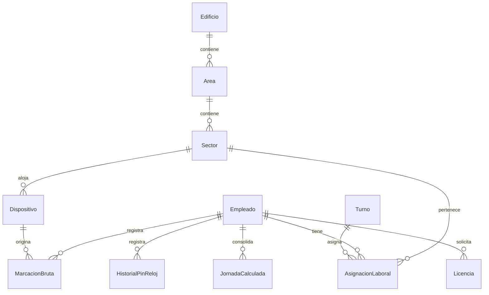
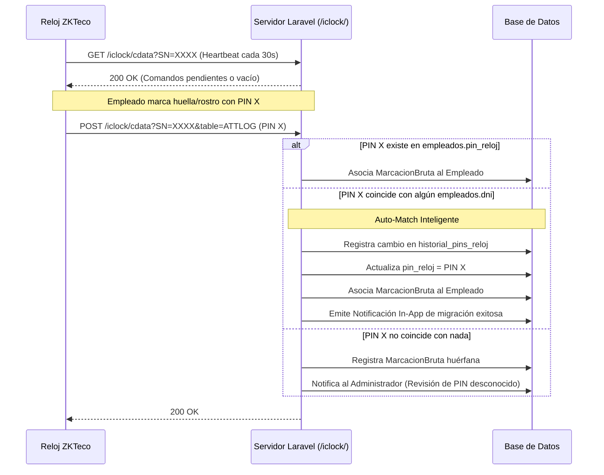

# Arquitectura Técnica — Sistema de Control de Asistencia
## Ministerio de Educación de San Juan

> **Stack:** Laravel 13 (PHP 8.4) + Vue 3 (Composition API + TypeScript) + Tailwind CSS + SQLite  
> **Protocolo Biométrico:** ZKTeco ADMS (HTTP Push /iclock/)  
> **Patrón Arquitectónico:** Modular por dominios (Backend y Frontend)

---

## 1. Principios de Modularidad

El sistema está concebido de manera desacoplada para permitir la reutilización de componentes entre distintos perfiles de empleados (planta_permanente, portero, contratado) y para facilitar la extensión a nuevos modelos de reloj o APIs gubernamentales.

### Frontend (
esources/js/modules/)
- modules/empleados/: Vistas de alta, edición y detalle de perfil, composable useEmpleado.
- modules/relojes/: Dashboard de dispositivos biométricos, telemetría y mapa de edificios.
- modules/asistencia/: Tablero diario en tiempo real (/asistencia) y tableros por sector (/sectores/:id/dashboard).
- modules/licencias/: Solicitud, justificación y aprobación de licencias ordinarias y médicas.
- modules/turnos/: Catálogo de plantillas de turnos y personalizaciones de horario.
- modules/shared/: Componentes transversales reutilizables:
  - TablaAsistencia.vue: Grilla de marcaciones y estados.
  - BadgeEstado.vue: Indicador visual de presencia (Presente, Ausente, Tardanza, Licencia, Modo Preparación).
  - SelectorHorario.vue: Selector de plantilla o asignación personalizada.
  - FiltroOrganigrama.vue: Selector cascada Edificio ➔ Área ➔ Sector.

### Backend (pp/Services/ y Dominios)
- JornadaService: Cálculo de horas trabajadas, detección de primera entrada/última salida y evaluación de tardanzas según tolerancias.
- DeviceDriverFactory: Abstracción multi-driver para dispositivos biométricos (ADMS y futuros protocolos SDK).
- PersonaDataProviderInterface: Contrato para integración con APIs externas de datos personales (RENAPER / Ciudadano Digital San Juan) para auto-completar datos según DNI.

---

## 2. Modelo de Datos y Entidades Principales

### Tabla `empleados`
- `id`: Autoincremental
- `nombre`, `apellido`, `dni`, `legajo`: Identificadores personales
- `pin_reloj`: Identificador en el reloj físico (`string`, `nullable`, `unique`). Soporta 4 dígitos actuales o transición a DNI.
- `sexo`: Opcional (`nullable`), clave para reportes demográficos y proyecciones jubilatorias.
- `fecha_nacimiento`: Opcional (`nullable`), permite calcular la edad dinámicamente en tiempo de ejecución.
- `tipo_contrato`: `planta_permanente` (Sprint 1), `portero` (Sprint 4) y `contratado` (Sprint 5).
- `permite_marcar_por_clave`: Booleano (restringido a choferes o personal sin biometría en destino).
- `alcance_biometrico`: Enum (`sector_habitual`, `sector_mas_central`, `red_global`, `comision_temporal`).
- `activo`: Booleano para baja lógica rápida.
- `motivo_baja`, `fecha_baja`, `resolucion_baja`: Metadatos de cese laboral (renuncia, fallecimiento, abandono, jubilación).
- `deleted_at`: SoftDeletes de Laravel. Impide que el agente figure en los tableros del día a día, pero preserva íntegro el valor probatorio de sus marcaciones históricas ante auditorías o sumarios. Al activarse, despacha `DATA DELETE USER` al reloj físico.

### Tabla `historial_pins_reloj` (Trazabilidad y Auditoría)
- `id`, `empleado_id`, `pin_anterior`, `pin_nuevo`, `origen` (`auto_match_dni` | `manual` | `reloj_adms`), `cambiado_en`, `motivo`.

### Módulo de Operativos Especiales y Banco de Horas
- `operativos_especiales`: `id`, `nombre`, `memo_resolucion`, `fecha_desde`, `fecha_hasta`, `modalidad`, `horas_reconocidas_por_dia`.
- `empleados_operativos`: Nómina afectada al operativo masivo por disposición de la autoridad.
- `banco_horas_compensatorias`: Cuenta corriente de horas (`credito`/`debito`) para acumular y compensar fines de semana trabajados o generar listas para liquidación de servicios extraordinarios.

### Tabla `biometria_templates` y `comisiones_biometricas`
- `biometria_templates`: Almacena el template matemático (rostro/huella) obtenido en el primer enrolamiento.
- `comisiones_biometricas`: Controla la habilitación temporal de un empleado (ej. portero de suplencia) en un reloj de otra escuela, encolando el envío de su template y su eliminación al concluir el plazo.

---

## 3. Flujo del Protocolo ADMS y Auto-Match Inteligente

---

## 4. Algoritmo de Cálculo de Jornada Multi-Sede (Personal Itinerante)

Para empleados que prestan servicios o realizan gestiones en más de un edificio durante la misma jornada (ej. entrada en Depósito Central y salida en Centro Cívico):

1. **Jornada Unificada por Empleado:**
   - La consolidación en `JornadaService` agrupa todas las `marcaciones_brutas` por `(empleado_id, fecha)` independientemente del dispositivo de origen.
2. **Determinación de Entrada y Salida:**
   - **Entrada:** Marcación más temprana del día ➔ `dispositivo_entrada_id`.
   - **Salida:** Marcación más tardía del día ➔ `dispositivo_salida_id`.
3. **Cómputo y Atribución Laboral:**
   - Si el `edificio_id` del dispositivo de entrada difiere del de salida, se marca `es_itinerante = true`.
   - Las horas trabajadas se imputan al **Sector de Asignación Activa** del empleado (su dependencia formal).
4. **Comportamiento en Tableros:**
   - **Tablero del Sector de Origen:** Refleja la jornada como cumplida indicando el edificio donde se registró la salida.
   - **Tablero del Edificio Visitado:** Registra la marcación en la sección de personal en tránsito o comisión, sin computar una entrada faltante.

---

## 5. Estrategia de Sectores y Tableros

1. **Sector con Reloj Online:** Muestra presencia en vivo y telemetría de red activa.
2. **Sector con Reloj Offline:** Alerta visual destacada en rojo; mantiene historial y empleados asignados.
3. **Sector sin Reloj (Modo Preparación):** Muestra banner preventivo ámbar informando que no se registran marcaciones automáticas, permitiendo cargar personal y turnos antes de la instalación física.
